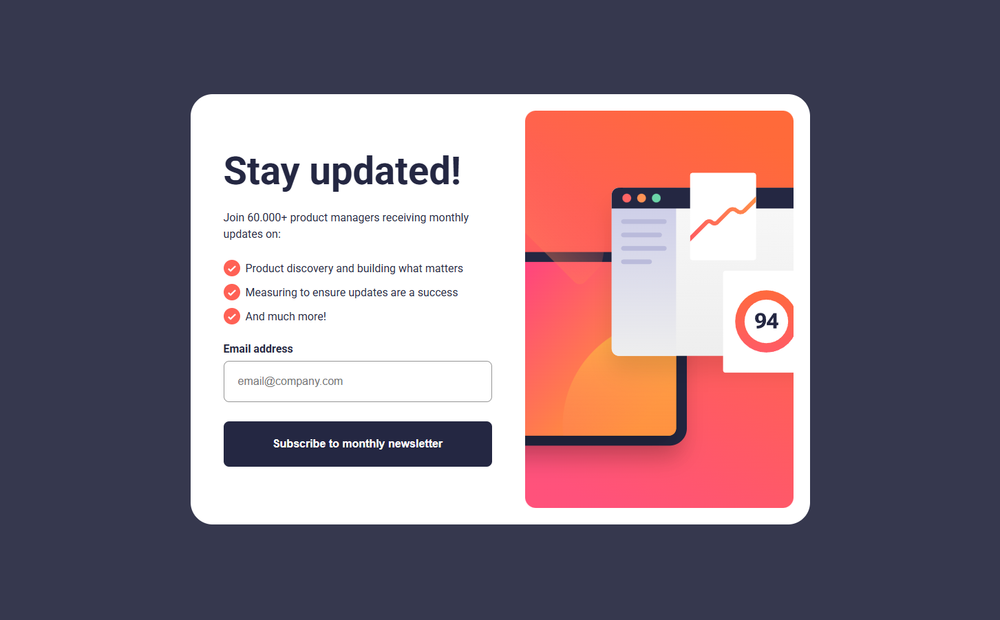
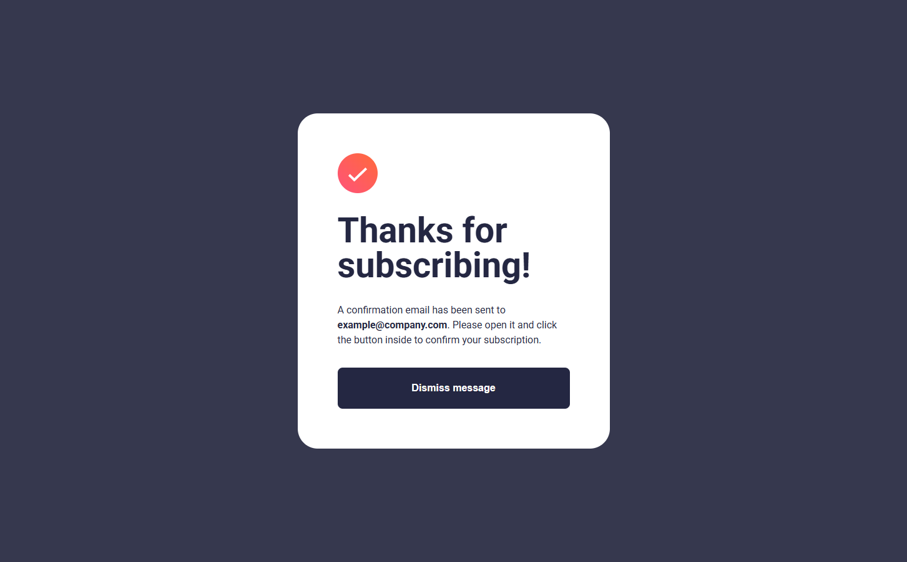

# 🌐 Frontend Mentor - Newsletter sign-up form with success message solution

This is my solution for th [Newsletter sign-up form with success message challenge on Frontend Mentor](https://www.frontendmentor.io/challenges/newsletter-signup-form-with-success-message-3FC1AZbNrv). Frontend Mentor challenges help you improve your coding skills by building realistic projects.

---

## 📋 Table of contents

- [Overview](#-overview)
  - [Features](#-features)
  - [Preview](#-preview)
  - [Links](#-links)
- [My process](#-my-process)
  - [Built with](#-built-with)
  - [What I learned](#-what-i-learned)
- [Development Workflow](#-development-workflow)
- [Useful Resources](#-useful-resources)
- [Author](#-author)
- [Acknowledgments](#-acknowledgments)

---

## 🌍 Overview

### ✨ Features

A responsive newsletter sign-up component with client-side email validation and a success confirmation state, built using semantic HTML, modern CSS, and vanilla JavaScript.

### 🖼️ Preview





### 🔗 Links

- 💡 Solution URL: [Frontend Mentor Submission](https://www.frontendmentor.io/solutions/newsletter-sign-up-form-with-css-and-js-dWc_MMYdOn)
- 🌐 Live Site URL: [Live Demo](https://thewizard04-newsletter-signup.vercel.app)

---

## 🛠️ My process

### 🧰 Built with

| Category  | Tools                     |
| --------- | ------------------------- |
| Structure | **Semantic HTML5 markup** |
| Styles    | **CSS**                   |

### 🧠 What I learned

- Improved my understanding of semantic HTML5 markup
- Strengthened my styling skills using CSS
- Improved my knowledge and skills with JavaScript

Here is the snippet for the form validation:

```js
const validateInputs = () => {
  const emailValue = emailInput.value.trim();
  const emailRegex = /^[a-zA-Z0-9._%+-]+@[a-zA-Z0-9.-]+\.[a-zA-Z]{2,}$/;

  if (emailValue.length === 0) {
    return setError("Email is required");
  }

  if (!emailValue.match(emailRegex)) {
    return setError("Please enter a valid email");
  }

  subscribeNewsletter(emailValue);
};
```

---

## 🧩 Development Workflow

### 🧱 Local Setup

1. **Start using CSS in your HTML**

   ```html
   <link rel="stylesheet" href="styles.css.css" />
   ```

2. Then open your index.html file in the browser.

---

## 📖 Useful Resources

- [MDN Web Docs](https://developer.mozilla.org/) – Trusted documentation and guides for modern web technologies.
- [W3Schools](https://www.w3schools.com/) – Easy-to-follow tutorials and references for learning web development.

---

## 👨‍💻 Author

- GitHub - [Jona Hamm](https://github.com/CrazyWizard04)
- Frontend Mentor - [@CrazyWizard04](https://www.frontendmentor.io/profile/crazywizard04)

---

## 💖 Acknowledgments

A big thanks to **Frontend Mentor** for providing this project.
Their challenges are a great way for developers of all levels to practice, learn, and improve their skills through real-world examples.

Thank you <3
